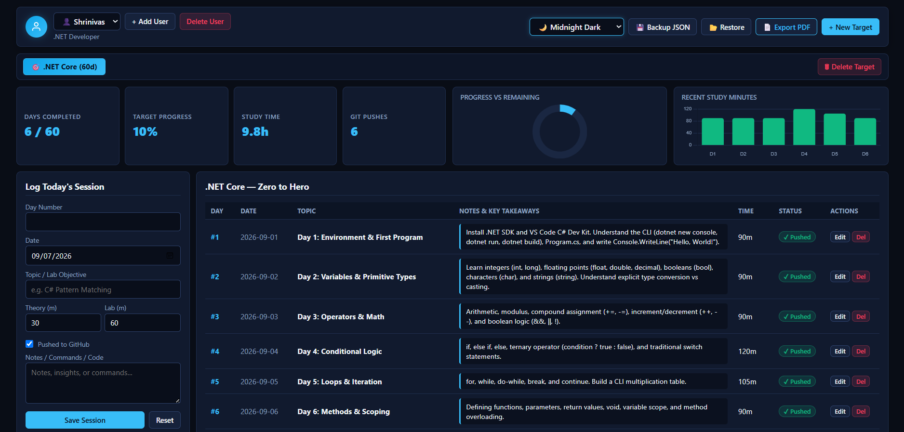
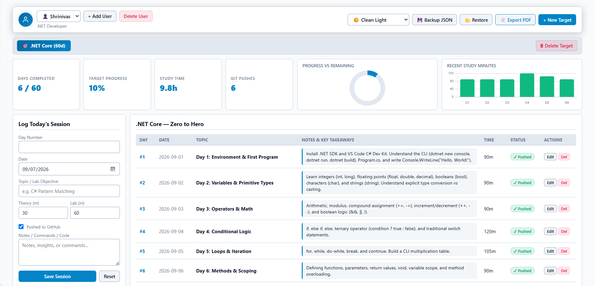
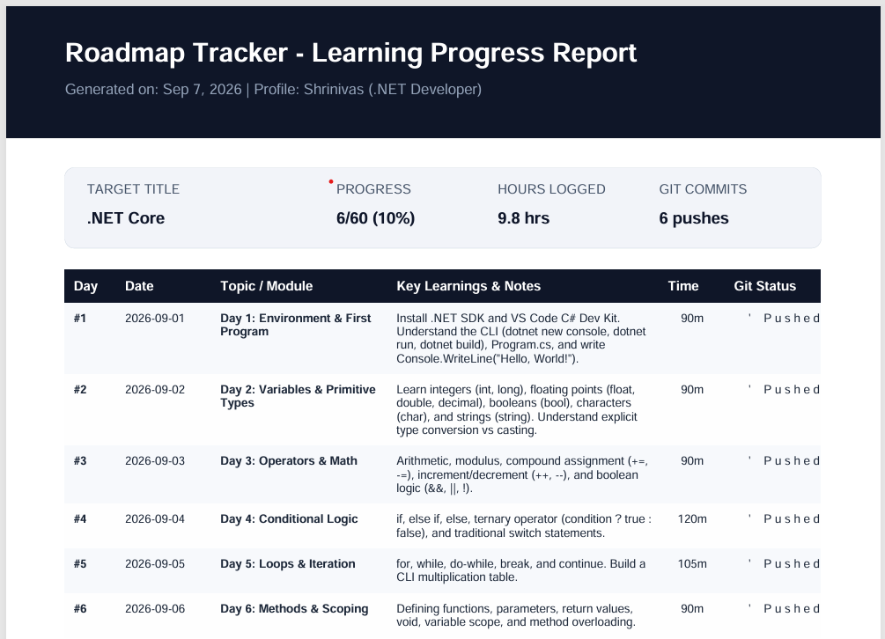

# RoadmapTracker 🎯

A high-performance, containerized developer progress tracker and learning roadmap dashboard built with **.NET 10 Minimal APIs**, **SQLite**, and **Docker**. Track daily engineering objectives, visualize study velocity, manage multiple learning targets across user profiles, and generate exportable reports.

---

## Features

- **Multi-Profile & Multi-Target Architecture:** Organize independent tracks (such as *.NET Core Mastery* or *Enterprise DevOps*) under distinct user profiles.
- **Embedded SQLite Engine:** Fully ACID-compliant relational persistence via Entity Framework Core SQLite, avoiding monolithic file lock contentions and running directly from a single database file (`roadmap.db`).
- **Live Analytics & Visualization:** Dynamic KPI counters, completion doughnut charts, and 7-day study velocity charts powered by Chart.js.
- **Dynamic Theming:** Instant switching between **Midnight Dark**, **Clean Light**, **Cyberpunk Neon**, and **Tokyo Night** with persistent state via `localStorage`.
- **Data Portability & Resilience:**
  - **Disaster Recovery:** Full database JSON export and atomic transactional restore to protect against accidental deletions.
  - **PDF Reports:** Clean, printable executive learning reports generated client-side via jsPDF and AutoTable.
- **Dockerized Deployment:** Multi-stage production container with host volume mapping (`~/tracker-data`) ensuring persistence across container rebuilds and restarts.

---

## Tech Stack

| Layer | Technology |
| :--- | :--- |
| **Backend Runtime** | .NET 10 (C# Minimal APIs) |
| **Database & ORM** | SQLite + Entity Framework Core 10 |
| **Frontend** | Vanilla ES6+ JavaScript, CSS3 Variables, Semantic HTML5 |
| **Data Visualization** | Chart.js |
| **Document Generation** | jsPDF, jsPDF-AutoTable |
| **Containerization** | Docker (Multi-stage build) |

---

## Project Structure

```text
RoadmapTracker/
├── Data/
│   └── AppDbContext.cs           # EF Core context & relational schema configuration
├── Models/
│   └── TrackerData.cs            # Domain entities (UserProfile, LearningTarget, DailyLog)
├── Services/
│   └── SqliteLogService.cs       # Transactional operations, seeding & recovery logic
├── Properties/
│   └── launchSettings.json
├── wwwroot/
│   ├── index.html                # Responsive application dashboard
│   ├── css/
│   │   └── style.css             # Theme palettes, modern buttons & glassmorphic styles
│   └── js/
│       └── app.js                # UI controller, Chart.js integrations & export engines
├── Dockerfile                    # Multi-stage production Docker build
├── Program.cs                    # Minimal API routing, dependency injection & startup
├── RoadmapTracker.csproj         # Project configurations & NuGet package dependencies
├── .gitignore                    # Artifact, cache, and database exclusions
└── README.md
```
## Screenshots

# Roadmap Tracker

Roadmap Tracker is a learning progress tracking application that allows you to manage user profiles, learning targets, and daily learning sessions. It also provides backup and recovery functionality using JSON and SQLite.

## Getting Started

### Prerequisites

Before running the application, make sure you have the following installed:

* [.NET 10 SDK](https://dotnet.microsoft.com/)
* [Docker Engine](https://docs.docker.com/engine/install/)

## Local Development

### Host Mode

To run the application directly on your development machine:

1. **Clone the repository:**

   ```bash
   git clone https://github.com/ssidral/RoadmapTracker.git
   cd RoadmapTracker
   ```

2. **Restore dependencies:**

   ```bash
   dotnet restore
   ```

3. **Run with hot reload:**

   ```bash
   dotnet watch run --urls "http://0.0.0.0:8080"
   ```

4. Open your browser and navigate to:

   ```text
   http://localhost:8080
   ```

The application will now be available locally with hot reload enabled.

## Production Deployment via Docker

The application can be deployed as a Docker container with persistent SQLite storage.

### 1. Create the Persistent Host Directory

Create a directory on the host machine for application data:

```bash
mkdir -p ~/tracker-data
sudo chmod -R 777 ~/tracker-data
```

> **Note:** The directory permissions above are intentionally permissive to avoid SQLite/container permission issues. For production environments, consider using more restrictive ownership and permissions appropriate for your deployment.

### 2. Build the Docker Image

Build the application image:

```bash
docker build -t roadmap-tracker:net10 .
```

### 3. Run the Container

Start the application in detached mode:

```bash
docker run -d \
  --name roadmap-tracker \
  --restart unless-stopped \
  -p 8080:8080 \
  -v ~/tracker-data:/app/data \
  roadmap-tracker:net10
```

### 4. Verify Container Status

Check that the container is running:

```bash
docker ps
```

View the application logs:

```bash
docker logs roadmap-tracker
```

The application will be accessible at:

```text
http://localhost:8080
```

## API Reference

### Profile Management

| Method   | Endpoint                             | Description                                   |
| -------- | ------------------------------------ | --------------------------------------------- |
| `GET`    | `/api/database`                      | Fetches the full database hierarchy           |
| `POST`   | `/api/profiles`                      | Creates a new user profile                    |
| `DELETE` | `/api/profiles/{profileId}`          | Deletes a user profile (retains at least one) |
| `POST`   | `/api/profiles/{profileId}/activate` | Sets the selected profile as active           |

### Target Management

| Method   | Endpoint                                       | Description                              |
| -------- | ---------------------------------------------- | ---------------------------------------- |
| `POST`   | `/api/profiles/{profileId}/targets`            | Adds a new learning target to a profile  |
| `DELETE` | `/api/profiles/{profileId}/targets/{targetId}` | Deletes a target and its associated logs |

### Daily Learning Logs

| Method   | Endpoint                                                        | Description                            |
| -------- | --------------------------------------------------------------- | -------------------------------------- |
| `POST`   | `/api/profiles/{profileId}/targets/{targetId}/logs`             | Upserts a daily learning session entry |
| `DELETE` | `/api/profiles/{profileId}/targets/{targetId}/logs/{dayNumber}` | Deletes a specific day's record        |

### Backup & Recovery

| Method | Endpoint              | Description                                                      |
| ------ | --------------------- | ---------------------------------------------------------------- |
| `GET`  | `/api/backup/export`  | Generates and downloads a timestamped JSON backup                |
| `POST` | `/api/backup/restore` | Atomically restores the full SQLite database from a JSON payload |

## Backup & Recovery

Roadmap Tracker supports multiple backup and recovery options.

### JSON Backup

Click **💾 Backup JSON** in the application to download a portable snapshot containing:

* All user profiles
* Learning targets
* Daily learning logs

The resulting JSON file can be stored separately and used for recovery.

### Database Restore

Click **📂 Restore**, select a valid backup `.json` file, and confirm the operation.

The backend performs the database replacement within an atomic database transaction to help guarantee data integrity during the restore operation.

### Physical SQLite Snapshot

You can also create a raw SQLite database backup directly on the host machine.

For Docker deployments using the default data directory:

```bash
cp ~/tracker-data/roadmap.db ~/tracker-data/roadmap_backup_$(date +%Y%m%d).db
```

This creates a dated SQLite snapshot such as:

```text
roadmap_backup_20260907.db
```

## Data Persistence

When running the application through Docker, the host directory:

```text
~/tracker-data
```

is mounted into the container at:

```text
/app/data
```

This ensures that the SQLite database persists even if the Docker container is removed or recreated.

The typical database location on the host is:

```text
~/tracker-data/roadmap.db
```

## Useful Docker Commands

### Stop the Application

```bash
docker stop roadmap-tracker
```

### Start the Application

```bash
docker start roadmap-tracker
```

### Restart the Application

```bash
docker restart roadmap-tracker
```

### View Logs

```bash
docker logs roadmap-tracker
```

To follow logs in real time:

```bash
docker logs -f roadmap-tracker
```

### Remove the Container

```bash
docker rm -f roadmap-tracker
```

> **Note:** Removing the container does not remove the persistent database stored in `~/tracker-data`.

## Accessing the Application

Once the application is running, open:

```text
http://localhost:8080
```

For a remote server, replace `localhost` with the server's hostname or IP address, assuming port `8080` is accessible.

or replace this section with the appropriate license for your project.

### Main Dashboard (Midnight Dark)


### Clean light Theme & Analytics


### PDF Progress Report
